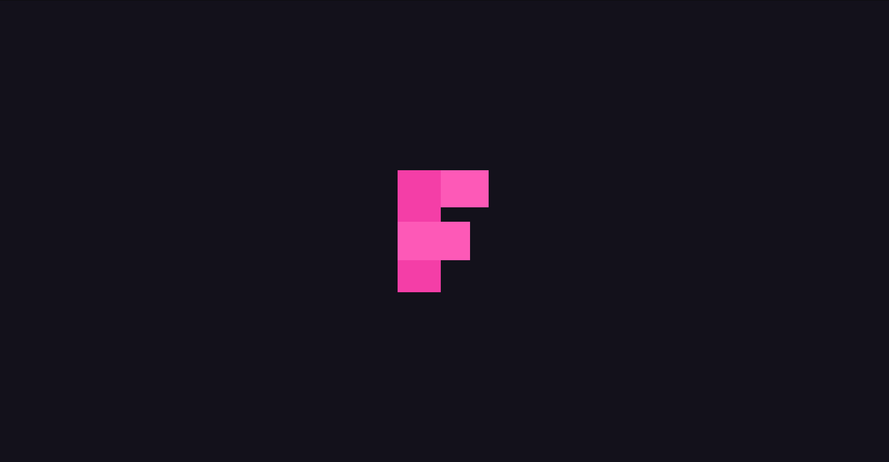
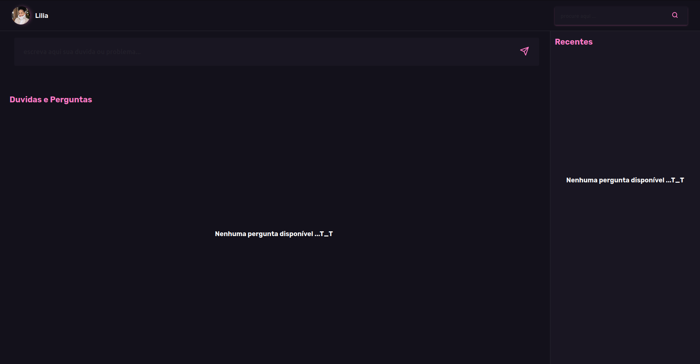
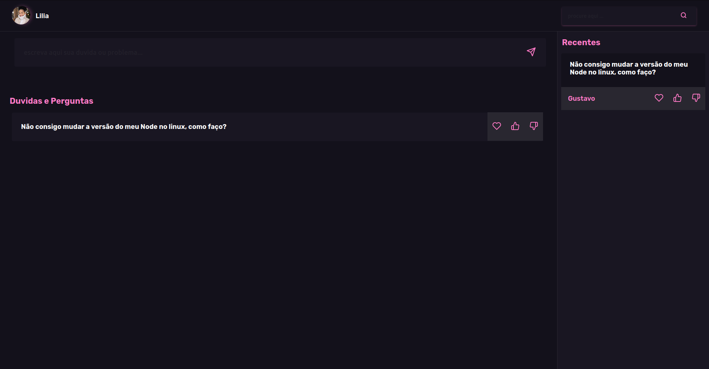

# Onboarding - Projeto Fórum

## Instalação

Nesta seção você encontra o tutorial de execução do projeto

1. Faça um clone do repositório:

```
git clone https://github.com/israelsilva282/Onboarding-Byte
```

2. Instale todos as dependências e pacotes necessários:

```
npm install
```

3. Inicie o projeto:

```
npm run serve
```

## Telas

1. Tela de início. Caminho: /
   

2. Tela do fórum. Caminho: /forum
   
   

## Tecnologias utilizadas


## Como usar

1. Ao iniciar a página inicial, a mesma permanecerá durante 2 segundos e em seguida mudará para a página do forum.
2. É possível adicionar novas perguntas através do input principal.
3. A remoção de perguntas tem que ser feita diretamente no storage do firebase.
